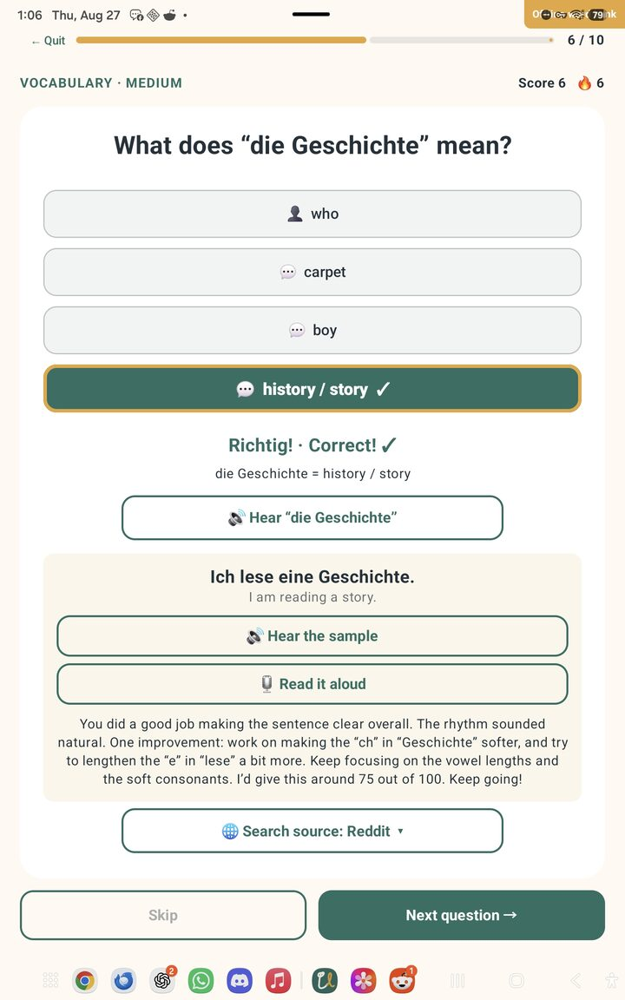
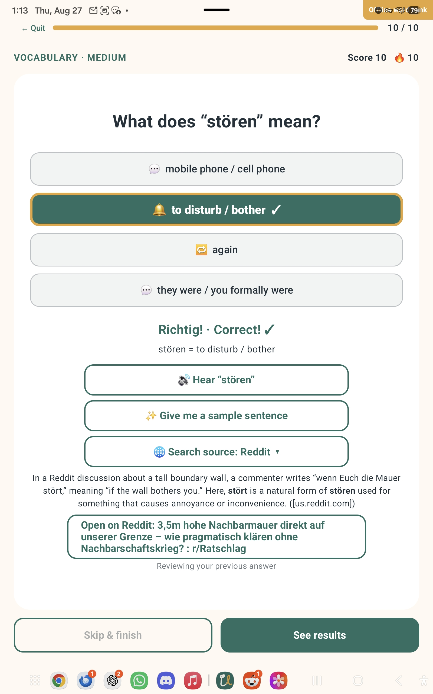

# Language Learning

Public legal text for OAuth setup is available in [`docs/PRIVACY.txt`](docs/PRIVACY.txt) and [`docs/TERMS.txt`](docs/TERMS.txt).

An offline Kotlin/Jetpack Compose quiz game for phones, tablets, and Android TV. It includes German content generated from the supplied vocabulary and grammar documents plus a starter French question set.

The home-screen language dropdown supports regional German and French varieties with country flags. All regions share the relevant German or French quiz bank; the selected region controls the accent requested when the user taps the pronunciation button after answering.

The home screen also has an **Easy / Medium / Hard** selector. Easy emphasizes core family, number, home, and everyday words; Medium covers general conversation and travel vocabulary; Hard includes less common forms, specialist vocabulary, and deliberately unfamiliar official technology terms. Difficulty is saved between launches.

Correct answers play a soft rising chime. Incorrect answers play a quiet two-note “uh-oh.” Both sounds are synthesized locally and follow the device's media volume.

## Screenshots

*A mid-quiz vocabulary screen after a correct answer for **die Geschichte** (“history / story”). The learner can hear the word, get a sample sentence, practice reading it aloud with scored feedback, then optionally search a real-world source such as Reddit.*

*End of a 10-question run: **stören** answered correctly as “to disturb / bother,” with a Reddit-sourced real-world example and an **Open on Reddit** button to the cited thread.*

## Open and run

1. Install Android Studio and let its setup wizard install the recommended Android SDK.
2. In Android Studio, choose **Open** and select this `LanguageLearning` folder.
3. Allow Gradle to sync. If prompted, install Android SDK 36.
4. Enable Developer options and USB or wireless debugging on the tablet.
5. Select the tablet in Android Studio and press **Run**.

## Run on Android TV or Google TV

1. On the TV, open **Settings > Device Preferences/System > About**.
2. Select **Build** seven times to enable Developer options. The exact labels vary by manufacturer.
3. Return to Settings, open **Developer options**, and enable **USB debugging** or **Wireless debugging** if the device offers it.
4. Put the TV and computer on the same network. In Android Studio, use **Pair Devices Using Wi-Fi** when the TV supports pairing, or connect through the TV/device manufacturer's supported USB or network-debugging method.
5. Approve the debugging prompt on the TV, select the TV as the deployment target, and press **Run**.

You can also test without a physical TV: in Android Studio's Device Manager, create an Android TV or Google TV virtual device and run the app on it. The interface is operable with a remote directional pad and Select/OK button.

## Customize the questions

The starter German and French vocabulary bank lives in:

`server/seed/quiz_data.json`

After first start, the live word bank is stored in SQLite and is easiest to edit in the server’s `/admin` page. Each vocabulary entry needs a `term` and `translation`. Add `article` and `noun` to automatically create an article question too. The optional `questions` list accepts custom vocabulary, article, or grammar questions with explanations, translations, and progressive hints.

JSON requires double quotes and commas between entries. Android Studio highlights mistakes in the file before you build.

Each SQLite vocabulary entry and custom question has an editable difficulty in the companion server's word-bank manager. Existing entries receive an initial semantic ranking during the database upgrade; manual changes made in the manager are preserved.

## Optional real-world examples

After a correct answer, the app lets the learner choose a source and press **Find an example**. German supports Reddit, Bluesky, gutefrage, and Der Spiegel. French supports Reddit, Bluesky, Jeuxvideo.com forums, Radio-Canada, and Le Monde. Nothing is sent to OpenAI until the learner explicitly presses the search button. The learning term, its English meaning, selected language, selected source, and explicit-content preference are then sent through the Rust companion server to OpenAI. The server keeps the API key out of the Android app and caches repeated lookups while it is running.

The app's Settings screen blocks explicit content by default. Users can opt into explicit results; Reddit posts marked `over_18` then display a red **NSFW** badge. The server rejects an `over_18` Reddit result when blocking is enabled. Source links must point to a directly cited post, thread, question, or article rather than a generic search page.

1. In `server`, copy `.env.example` to `.env` and replace the placeholder with your OpenAI API key.
2. Start the helper with `cargo run --release` from the `server` folder.
3. Add `SERVER_URL=http://YOUR_COMPUTER_IP:41082` to `local.properties`. Use your computer's local network address, not `localhost`.
4. Keep the tablet or TV on the same network as the computer, then rebuild and install the Android app.

The default model is `gpt-5.6-luna`, the lowest-cost current model verified to support Responses API web search. You can change `OPENAI_MODEL` in `server/.env`. Each uncached button press can incur one model request and one web-search tool call; merely answering correctly does not. `MAX_UNCACHED_REQUESTS` defaults to 25 per server run as a hard safety cap. Setting a monthly project budget in the OpenAI dashboard provides an additional account-level guardrail.

## Notes on source cleanup

The vocabulary source appears to contain a few typos or mismatched articles. Obvious examples were normalized in the game (`die Brücke`, `die Farbe`, `der Rentner`, and `schließen`). Items whose intended meaning was unclear were omitted.
